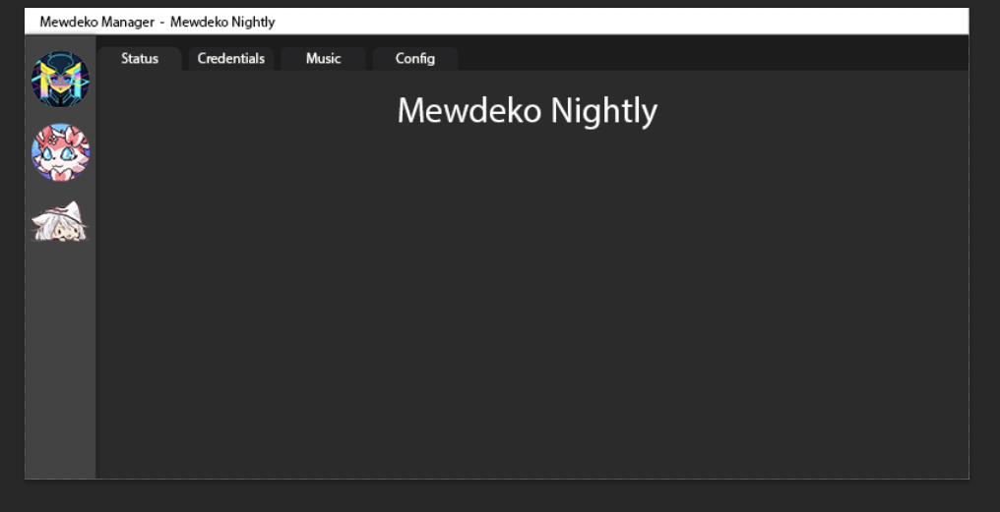

---

# Mewdeko Manager

## Overview

**Mewdeko Manager** is an upcoming tool designed to streamline the management and monitoring of Mewdeko bots.

## Features

- Install new Mewdekos
- View current music playing
- Modify credentials on the fly
- View server permissions
- Manage blacklist

## Technologies

- **Framework**: [Avalonia](https://avaloniaui.net/)
- **Language**: C# with .NET 8

## Status

Work in progress (WIP). Stay tuned!

## License

Licensed under AGPLv3. See the [LICENSE](LICENSE) file for details.

## Stay in Touch

Join our community on [Discord](https://discord.gg/deko).

---